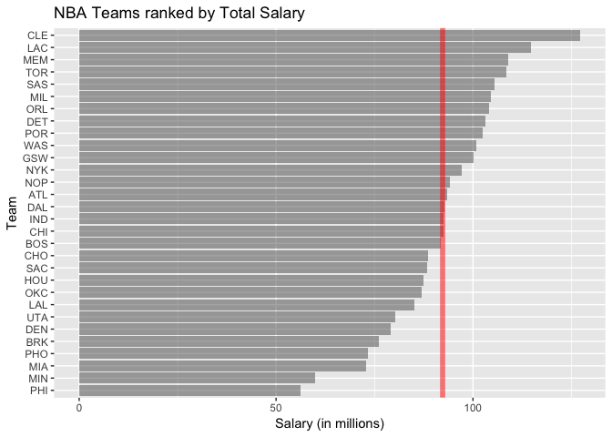
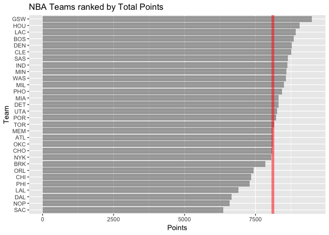
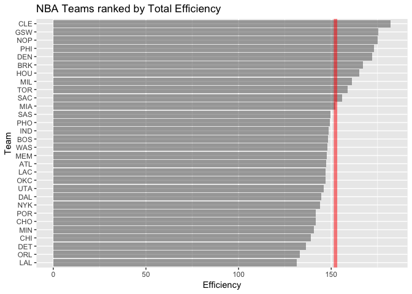
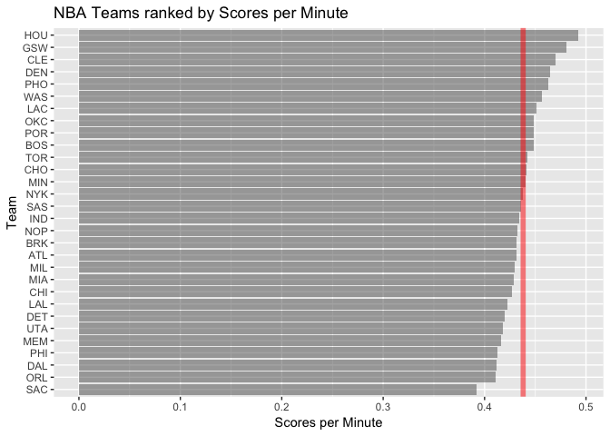

Workout1-bailey-bounds.Rmd
================
Bailey Bounds
9/30/2018

Loading Packages
================

``` r
library(readr)
library(dplyr)
```

    ## Warning: package 'dplyr' was built under R version 3.4.4

    ## 
    ## Attaching package: 'dplyr'

    ## The following objects are masked from 'package:stats':
    ## 
    ##     filter, lag

    ## The following objects are masked from 'package:base':
    ## 
    ##     intersect, setdiff, setequal, union

``` r
library(ggplot2)
```

    ## Warning: package 'ggplot2' was built under R version 3.4.4

Loading Data
============

``` r
dat <- read_csv('../data/nba2018-teams.csv')
```

    ## Parsed with column specification:
    ## cols(
    ##   team = col_character(),
    ##   experience = col_integer(),
    ##   salary = col_double(),
    ##   points3 = col_integer(),
    ##   points2 = col_integer(),
    ##   points1 = col_integer(),
    ##   points = col_integer(),
    ##   off_rebounds = col_integer(),
    ##   def_rebounds = col_integer(),
    ##   assists = col_integer(),
    ##   steals = col_integer(),
    ##   blocks = col_integer(),
    ##   turnovers = col_integer(),
    ##   fouls = col_integer(),
    ##   efficiency = col_double(),
    ##   minutes = col_integer()
    ## )

### Basic Rankings

``` r
rank_team_by_salary <- arrange(
                          summarise(
                            group_by(dat, team),
                            total_salary = sum(salary)), 
                          desc(total_salary))
```

    ## Warning: package 'bindrcpp' was built under R version 3.4.4

``` r
ggplot(data = rank_team_by_salary, aes(x = reorder(team, total_salary), y = total_salary)) + geom_bar(stat = 'identity', alpha = 0.5) + coord_flip() + labs(x = "Team", y = "Salary (in millions)", title = "NBA Teams ranked by Total Salary") + geom_hline(yintercept = mean(rank_team_by_salary$total_salary), color = "red", size = 2, alpha = 0.5)
```



``` r
ggsave(filename = "workout01-bailey-bounds_files/rank_team_by_salary.pdf", width = 7, height = 5)
```

``` r
rank_team_by_points <- arrange(
                          summarise(
                            group_by(dat, team),
                            total_points = sum(points)), 
                          desc(total_points))

ggplot(data = rank_team_by_points, aes(x = reorder(team, total_points), y = total_points)) + geom_bar(stat = 'identity', alpha = 0.5) + coord_flip() + labs(x = "Team", y = "Points", title = "NBA Teams ranked by Total Points") + geom_hline(yintercept = mean(rank_team_by_points$total_points), color = "red", size = 2, alpha = 0.5)
```



``` r
ggsave(filename = "workout01-bailey-bounds_files/rank_team_by_points.pdf", width = 7, height = 5)
```

``` r
rank_team_by_eff <- arrange(
                          summarise(
                            group_by(dat, team),
                            total_eff = sum(efficiency)), 
                          desc(total_eff))

ggplot(data = rank_team_by_eff, aes(x = reorder(team, total_eff), y = total_eff)) + geom_bar(stat = 'identity', alpha = 0.5) + coord_flip() + labs(x = "Team", y = "Efficiency", title = "NBA Teams ranked by Total Efficiency") + geom_hline(yintercept = mean(rank_team_by_eff$total_eff), color = "red", size = 2, alpha = 0.5)
```



``` r
ggsave(filename = "workout01-bailey-bounds_files/rank_team_by_eff.pdf", width = 7, height = 5)
```

### My own Ranking system

``` r
dat <- mutate(dat, SPM = points/minutes)

rank_team_by_SPM <- arrange(
                          summarise(
                            group_by(dat, team),
                            total_SPM = sum(SPM)), 
                          desc(total_SPM))

ggplot(data = rank_team_by_SPM, aes(x = reorder(team, total_SPM), y = total_SPM)) + geom_bar(stat = 'identity', alpha = 0.5) + coord_flip() + labs(x = "Team", y = "Scores per Minute", title = "NBA Teams ranked by Scores per Minute") + geom_hline(yintercept = mean(rank_team_by_SPM$total_SPM), color = "red", size = 2, alpha = 0.5)
```



``` r
ggsave(filename = "workout01-bailey-bounds_files/rank_team_by_spm.pdf", width = 7, height = 5)
```

-   I chose to rank teams by score per minute simply because in order to win you have to score the most points

Comments and Reflections:
=========================

-   Yes this was my first time, and this file structure makes sense to me
-   Yes, and yes it is important since everyone's file structure on their computer is very different so controlling for that by just moving inside the project directory makes lots of sense
-   Yes, and I don't like rscript as much as rmarkdown, I like rmarkdown a lot, but I am becoming more familiar with it. I wish there was an easier way to write out long multiple line comments and titles
-   I think before lab06 a lot of the things that weren't discussed like the data dictionary or sink etc were pretty confusing
-   I thought the ggplot wasn't too difficult for the team rankings
-   No
-   5 hours
-   R script for make-teams-table
-   figuring out sink and write\_csv and using this file structure
